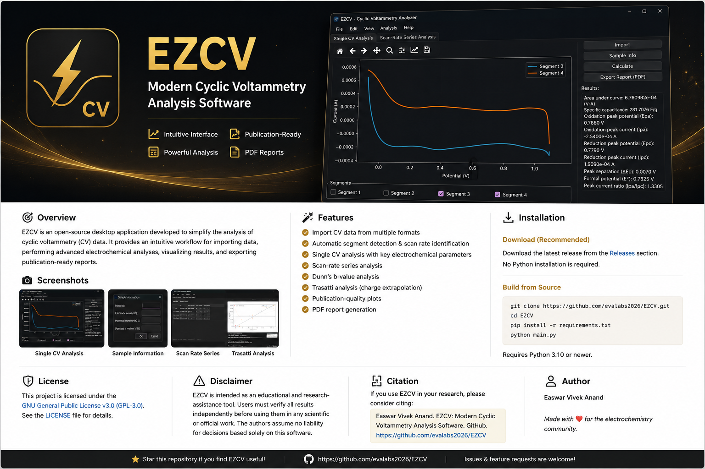
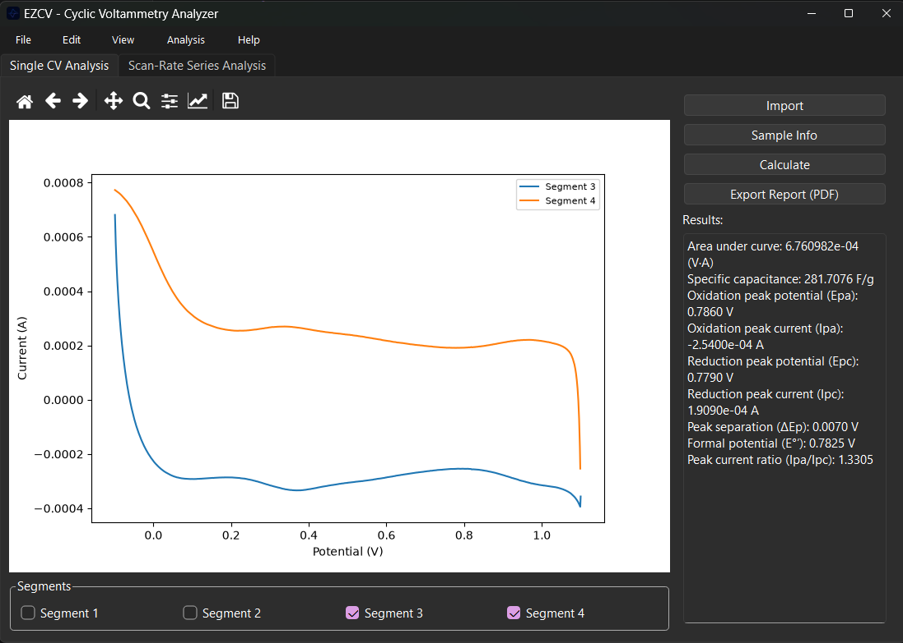
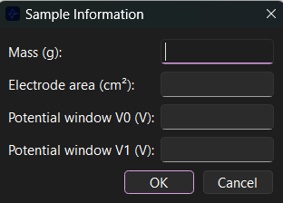
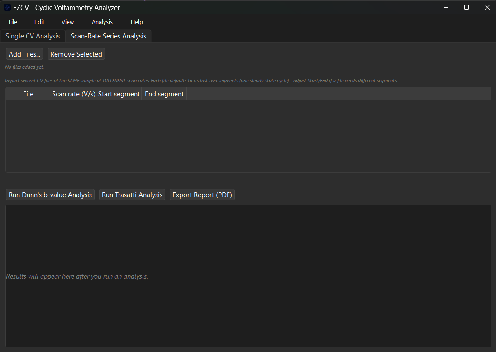
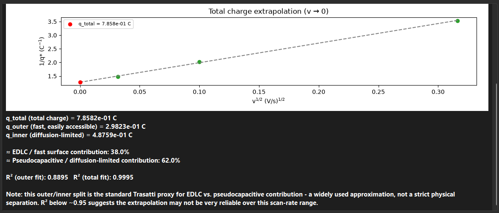

<<<<<<< HEAD
<p align="center">
  
</p>

<div align="center">

# EZCV

### Modern Cyclic Voltammetry Analysis Software

A desktop application for cyclic voltammetry (CV) analysis featuring automated electrochemical calculations, publication-quality plots, and PDF report generation.


</div>

---

# Overview

EZCV is an open-source desktop application developed to simplify cyclic voltammetry data analysis for researchers, students, and electrochemists.

The software provides an intuitive graphical interface for importing cyclic voltammetry data, performing common electrochemical analyses, visualizing results, and exporting professional PDF reports.

Whether you are analyzing a single cyclic voltammogram or an entire scan-rate series, EZCV streamlines repetitive calculations and presents results in a clean, publication-ready format.

---

# Features

## Import & Visualization

- Import cyclic voltammetry data from supported text formats
- Automatic scan segment detection
- Automatic scan-rate identification
- Interactive CV plotting
- Zoom, pan and navigation tools

---

## Single CV Analysis

- Area under CV curve
- Specific capacitance
- Oxidation peak potential (Epa)
- Reduction peak potential (Epc)
- Peak currents
- Peak separation (ΔEp)
- Formal potential (E°)
- Peak current ratio (Ipa/Ipc)
- Publication-quality plots
- PDF report generation

---

## Scan-Rate Series Analysis

- Import multiple CV files simultaneously
- Automatic scan-rate table generation
- Individual segment selection
- Batch electrochemical analysis
- Comparative visualization

---

## Dunn's b-value Analysis

- Automatic power-law fitting
- Linear regression
- Determination of b-value
- Publication-ready plots

---

## Trasatti Analysis

- Outer charge extrapolation
- Total charge extrapolation
- Inner charge estimation
- EDLC contribution
- Diffusion-controlled contribution
- Linear regression statistics (R²)
- PDF report generation

---

# Screenshots

## Main Window

<p align="center">

</p>

Interactive cyclic voltammetry visualization together with automatic electrochemical parameter calculation.

---

## Sample Information

<p align="center">

</p>

Enter sample mass, electrode area and potential window before performing calculations.

---

## Scan-Rate Series

<p align="center">

</p>

Analyze multiple cyclic voltammograms collected at different scan rates for kinetic studies.

---

## Trasatti Analysis

<p align="center">

</p>

Automatic determination of outer charge, total charge, inner charge and capacitive contributions.

---

# Installation

## Download (Recommended)

Download the latest version from the **Releases** page.

No Python installation is required.

---

## Running from Source

Clone the repository

```bash
git clone https://github.com/evalabs2026/EZCV.git
```

Move into the project directory

```bash
cd EZCV
```

Install dependencies

```bash
pip install -r requirements.txt
```

Launch EZCV

```bash
python main.py
```

---

# System Requirements

- Windows 10 or later
- Python 3.10 or newer (only when running from source)

---

# License

This project is licensed under the **GNU General Public License v3.0 (GPL-3.0)**.

See the **LICENSE** file for details.

---

# Disclaimer

EZCV is intended as an educational and research-assistance tool.

Although care has been taken to implement commonly accepted electrochemical calculations, users are responsible for independently verifying all generated values before using them in publications, theses, patents or other scientific work.

The authors assume no responsibility for decisions made solely on the basis of software-generated results.

---

# Citation

If EZCV contributes to your research, please consider citing the software in your acknowledgements or methodology section.

Example citation:

```
Easwar Vivek Anand.

EZCV: Modern Cyclic Voltammetry Analysis Software.

GitHub.

https://github.com/evalabs2026/EZCV
```

---

# Contributing

Bug reports, feature requests and pull requests are welcome.

Please open an Issue before submitting major changes.

---

# Author

**Easwar Vivek Anand**

---

<div align="center">

Made with ❤️ for the electrochemistry community.

⭐ If EZCV helps your research, consider starring the repository.

</div>
=======
<p align="center">
  
</p>

<div align="center">

# EZCV

### Modern Cyclic Voltammetry Analysis Software

A desktop application for cyclic voltammetry (CV) analysis featuring automated electrochemical calculations, publication-quality plots, and PDF report generation.


</div>

---

# Overview

EZCV is an open-source desktop application developed to simplify cyclic voltammetry data analysis for researchers, students, and electrochemists.

The software provides an intuitive graphical interface for importing cyclic voltammetry data, performing common electrochemical analyses, visualizing results, and exporting professional PDF reports.

Whether you are analyzing a single cyclic voltammogram or an entire scan-rate series, EZCV streamlines repetitive calculations and presents results in a clean, publication-ready format.

---

# Features

## Import & Visualization

- Import cyclic voltammetry data from supported text formats
- Automatic scan segment detection
- Automatic scan-rate identification
- Interactive CV plotting
- Zoom, pan and navigation tools

---

## Single CV Analysis

- Area under CV curve
- Specific capacitance
- Oxidation peak potential (Epa)
- Reduction peak potential (Epc)
- Peak currents
- Peak separation (ΔEp)
- Formal potential (E°)
- Peak current ratio (Ipa/Ipc)
- Publication-quality plots
- PDF report generation

---

## Scan-Rate Series Analysis

- Import multiple CV files simultaneously
- Automatic scan-rate table generation
- Individual segment selection
- Batch electrochemical analysis
- Comparative visualization

---

## Dunn's b-value Analysis

- Automatic power-law fitting
- Linear regression
- Determination of b-value
- Publication-ready plots

---

## Trasatti Analysis

- Outer charge extrapolation
- Total charge extrapolation
- Inner charge estimation
- EDLC contribution
- Diffusion-controlled contribution
- Linear regression statistics (R²)
- PDF report generation

---

# Screenshots

## Main Window

<p align="center">

</p>

Interactive cyclic voltammetry visualization together with automatic electrochemical parameter calculation.

---

## Sample Information

<p align="center">

</p>

Enter sample mass, electrode area and potential window before performing calculations.

---

## Scan-Rate Series

<p align="center">

</p>

Analyze multiple cyclic voltammograms collected at different scan rates for kinetic studies.

---

## Trasatti Analysis

<p align="center">

</p>

Automatic determination of outer charge, total charge, inner charge and capacitive contributions.

---

# Installation

## Download (Recommended)

Download the latest version from the **Releases** page.

No Python installation is required.

---

## Running from Source

Clone the repository

```bash
git clone https://github.com/evalabs2026/EZCV.git
```

Move into the project directory

```bash
cd EZCV
```

Install dependencies

```bash
pip install -r requirements.txt
```

Launch EZCV

```bash
python main.py
```

---

# System Requirements

- Windows 10 or later
- Python 3.10 or newer (only when running from source)

---

# License

This project is licensed under the **GNU General Public License v3.0 (GPL-3.0)**.

See the **LICENSE** file for details.

---

# Disclaimer

EZCV is intended as an educational and research-assistance tool.

Although care has been taken to implement commonly accepted electrochemical calculations, users are responsible for independently verifying all generated values before using them in publications, theses, patents or other scientific work.

The authors assume no responsibility for decisions made solely on the basis of software-generated results.

---

# Citation

If EZCV contributes to your research, please consider citing the software in your acknowledgements or methodology section.

Example citation:

```
Easwar Vivek Anand.

EZCV: Modern Cyclic Voltammetry Analysis Software.

GitHub.

https://github.com/evalabs2026/EZCV
```

---

# Contributing

Bug reports, feature requests and pull requests are welcome.

Please open an Issue before submitting major changes.

---

# Author

**Easwar Vivek Anand**

---

<div align="center">

Made with ❤️ for the electrochemistry community.

⭐ If EZCV helps your research, consider starring the repository.

</div>
>>>>>>> bdca025b8d3e82eca592e97b649d164e5e05ee69
